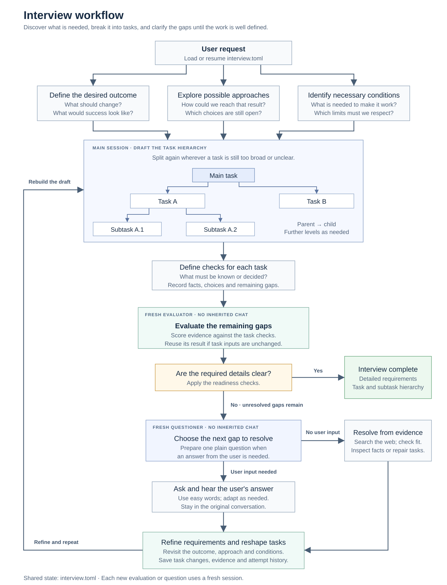
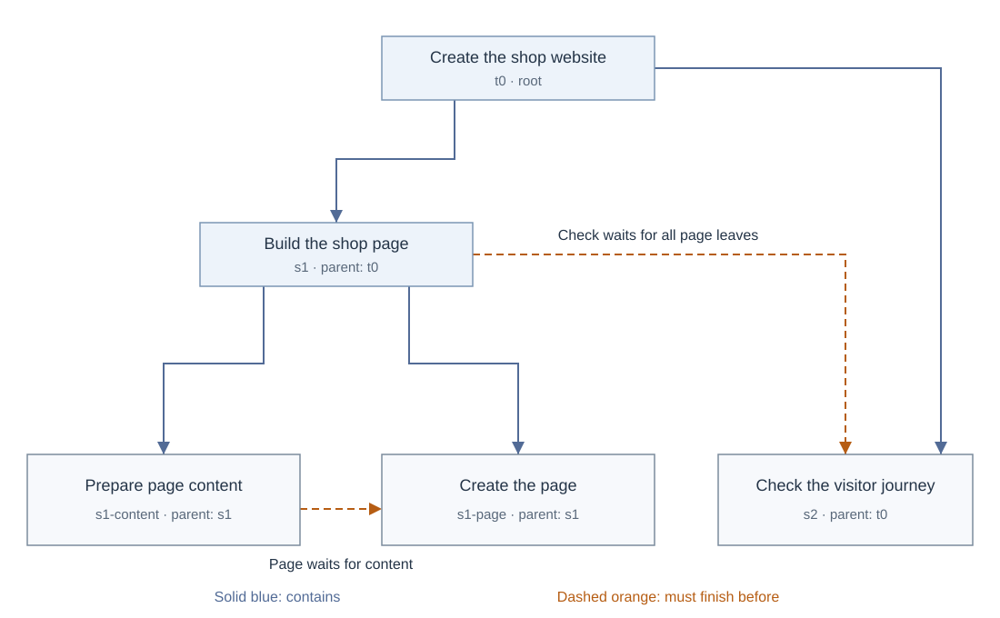
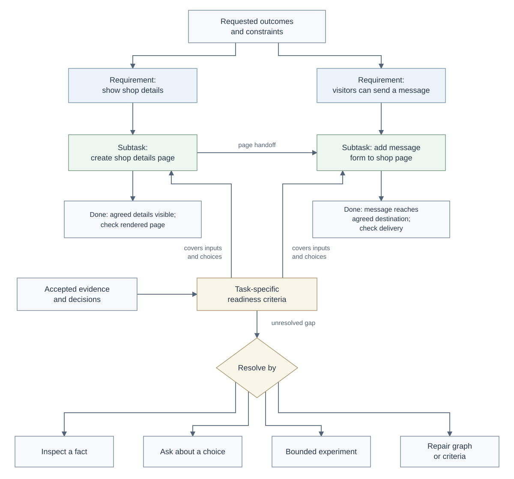

# interview

Develop initial intent into a precise specification through adaptive, in-depth
requirements interviews. Uncover implicit assumptions, resolve ambiguity, and
establish clear behavior, scope, constraints, and acceptance criteria. Refine
requirements and task decomposition together, producing a coherent hierarchy
of tasks and subtasks grounded in the user's answers.

The interview produces a requirements brief and task hierarchy in `interview.toml`.
Scoring helps find unresolved gaps and decide when enough detail has been gathered.
Implementation follows only when the user also requests it.

## Use

```text
interview: help me define what this app should do and break it into tasks
interview: dig into the unclear parts of my shop website idea, one question at a time
interview: help me narrow down a research topic using simple explanations
```

Install from this repository using an agent that supports skills:

```sh
npx skills add ujon/skills --skill interview
```

The host must support fresh worker sessions without inherited conversation.
The skill supplies instructions, worker contracts, a state template, a validation
helper, and an optional local graph viewer; it is not a standalone agent service.
It is for requirements and decision discovery, not job interview practice.

## Flow



The request is explored through its desired outcome, possible approaches, and
necessary conditions. These inform a provisional task hierarchy and checks for
each task. A fresh evaluation either completes the interview or passes remaining
gaps to a fresh questioner. Questions and non-user resolution routes converge on
requirements refinement and hierarchy review. Changed task inputs require a new
evaluation; unchanged inputs retain the current valid result.

The main-session coordinator decomposes and revises tasks and alone writes the
state file. Every evaluation and every new
question uses a newly created worker. The evaluator receives task evidence and
criteria without thresholds, weights, previous scores, or user-familiarity estimates. The questioner
receives the current evaluation, explanation profile, and question/action history. Neither worker receives
the parent conversation. Their replies return to the original conversation.

This controls what history is shared; it does not eliminate model priors or bias
in the saved evidence. If fresh contexts are unavailable, the skill records the
limitation and blocks the interview loop; it cannot substitute an in-session
evaluation or questioner. A user request to proceed with known gaps does not
relax this boundary. See the
[worker contracts](references/isolated-rounds.md) and
[official subagent documentation](https://learn.chatgpt.com/docs/agent-configuration/subagents)
for the runtime background.

## From a request to executable work

Define the desired outcome, explore possible approaches, and identify necessary
inputs, prerequisites, constraints, and exclusions as distinct discovery steps.
Give requirements stable IDs, then connect each in-scope requirement to the work
that will satisfy it. Keep the user's reasons and conditions with their evidence;
do not turn a qualified answer into an unconditional choice.

Tasks can contain tasks at any depth. The root and all descendants use the same
`[[tasks]]` format: `parent_id` records which larger task contains the work, while
`depends_on` records what must finish first. Children do not automatically depend
on their parent or siblings. The request and its root task ID live in `[request]`.

Each leaf task has inputs, a deliverable, `done_when` completion conditions,
a verification method, and only the prerequisites it actually needs. Split work
when outputs, decisions, or handoffs can be handled separately. Stop when the
leaf can be executed and checked without hiding a material choice. A small task
can remain one leaf; interview questions are not implementation subtasks.

For example, the [template](assets/interview.template.toml) represents a website
task containing a page task, which itself contains content and page-building
tasks. A separate checking task waits for the page task's leaves to finish.
Every task stores a `status`: `pending` before execution, `running` while work
remains after starting, or `done` after its completion checks pass. Groups store
the aggregate of their descendant leaves: all pending, all done, or otherwise
running. Validation checks this consistency, including the root. See the
[status definitions and transitions](references/state-schema.md#task-status).
Further splitting keeps the parent ID and gives the new children their own IDs.





The evaluator checks both directions: every requested result needs covering work,
and every leaf needs a reason to exist. Mapping a requirement only to a parent
does not prove that its leaves cover it. Dependencies cannot contain cycles,
including after a dependency on a group expands to its leaves. Criteria and
decisions may target a group to apply to all its descendants, or target only the
affected leaf. Shared criteria count once overall and once per covered leaf.

Source facts are inspected before asking the user. When a method choice has no
user input, the coordinator searches the web, checks current primary sources,
and selects a widely used approach compatible with the request. It records source
URLs, why the method fits, and its adoption as a default rather than a user answer.
Search ranking alone is not adoption evidence, and popularity cannot override
the user's constraints. See the [web default policy](references/web-defaults.md).

Missing intent and private facts still need clarification. Unknown feasibility
may need a bounded experiment; broken structure needs repair. After a valid
evaluation fails, the fresh questioner selects the next resolution route and the
coordinator performs it. All findings return to requirements and hierarchy review;
unrelated evidence stays. Invalid state or worker reports use technical recovery.
Non-question plans and results stay in `attempts`, including failed searches and
inconclusive checks. The next questioner sees this history and avoids repeating
an unproductive route without a concrete new reason.

## Redefine the hierarchy as you learn

The initial task tree is provisional. After the first draft, new answers or
findings, changed scope, or execution blockers, the coordinator explicitly reviews
whether the current parents and children still fit. The fresh evaluator can also
send structural findings back to this step. A useful tree can remain unchanged.

The step can split a task, merge duplicate work, move tasks to another parent,
regroup shared work, or remove an unnecessary wrapper. It preserves unchanged
task IDs, verified outputs, decisions, and completed work. It checks inherited
criteria and expanded execution dependencies before and after: moving a child
can change their meaning even when the recorded target IDs stay the same.

Actual changes are recorded in `interview.toml`, validated, and evaluated again
in a fresh session; old readiness does not transfer automatically. See the
[redefinition procedure](references/task-refinement.md#redefine-the-hierarchy).

## Readiness gate

Each criterion receives a score:

| Score | Evidence readiness |
| --- | --- |
| 0 | Missing, conflicting, or too vague |
| 1 | Partial; evidence or a material choice remains unresolved |
| 2 | Specific, supported, and sufficient to execute and check |

`Readiness = 100 × sum(weight × score) / (2 × sum(weight))`

Default pass conditions: overall score **90 or more**, each leaf **80 or
more**, every required criterion at **2**, all required decisions resolved, and
no material contradictions, missing requirement coverage, or missing criteria.
A high average cannot hide an unresolved required decision. Scores measure
information readiness, not user ability or the probability of project success.
Every positive rating needs active evidence linked to its criterion or decisions;
score 2 also requires all supporting citations to be accepted. Unsupported
ratings receive zero credit, and the viewer displays those credited scores.
Parent scores use the distinct criteria covering their leaves, with no repeated
counting or averaging of child scores. A failing leaf blocks readiness even when
its parent's score is high. Actual integration work needs its own executable leaf.

Criteria and thresholds are recorded before evaluation. A scope or rubric change
invalidates the previous result and triggers a fresh evaluation. A fully specified
request can pass immediately. The interview ends with detailed requirements,
decisions, and a task breakdown; implementation follows if also requested. Readiness means
the work is sufficiently defined to start. It does not prove the implementation
exists or meets its `done_when` conditions; those are checked during execution.

## Easy questions that adapt

Questions start with short sentences, familiar words, and concrete examples.
The agent explains a needed idea simply, checks the meaning when useful, and
asks about the most consequential missing choice. For example:

> What should customers find first on this page?
> You can choose the shop's location, products, or opening hours, or give your own answer.

If the answer is “make it easy to contact us,” follow up on what contact means:
calling the shop, sending a message, or requesting a booking. Then explore any
remaining behavior or boundary that changes the requirement and update the
affected tasks. Choosing an option does not automatically finish clarification.

The file tracks familiarity **by topic**, the evidence for that observation,
and the user's preferred explanation depth. Detail increases gradually as the
user demonstrates comfort or asks for it. Questions remain plainly worded.
This is not an IQ estimate; an expert can still prefer a simple explanation.
Changing only explanation preferences or profile-only observations preserves the
current task evaluation. The next questioner receives the updated profile;
responses prepared against an outdated packet are discarded.

“I don't know” about a method leads to web research and a documented default.
Unclear intent or private facts lead to an easier example or a small comparison;
uncertain feasibility may need a bounded experiment. Repeated lack of progress
leads to a smaller scope or a pause.
Users can stop, ask for a summary, or explicitly proceed with known gaps. Such
an override is recorded and is never disguised as a passing score.

## Research-informed design and context size

The questioner compares plausible answers by what they would change in the work,
then considers answerability, user effort, and repetition. A model's uncertainty
alone is not a reason to interrupt the user. The evaluator ties each rating to
specific evidence and separates missing support from contradictory evidence.
Fresh sessions reduce shared conversation history; they do not prove unbiased
or statistically independent judgment.

`SKILL.md` is a compact operating contract with a conditional reading map.
Evaluator and questioner instructions live in separate files; each worker receives
only its own contract and packet. Research, examples, and unrelated reference
sections stay outside routine context. Complete task evidence remains in the
single TOML; shortening a packet must not erase constraints or hide missing work.

See [research and evaluation](references/research-and-evaluation.md) for the
2025–2026 papers, publication status, limitations, and behavioral checks. Research
supports testing selective context loading and grounded assessment, not a
universal Markdown length limit or a guarantee that shorter prompts work better.

## One state file

Use one `interview.toml` file.

Preserve user requests, answers, evidence, reasons, and history faithfully,
including conditions, uncertainty, and source attribution. No storage language
is prescribed. Exact identifiers, paths, URLs, and code remain usable.
`user.language` guides the conversation and question wording.

The file contains the request, traceable requirements, task hierarchy, dependencies, criteria and
thresholds, sourced facts and assumptions, decisions, questions and answers,
resolution attempts, evaluations, and explanation preferences. The `interview_schema` setting in
[SKILL.md](SKILL.md) determines `schema_version`. The current schema (1) uses a unified `tasks`
list with `parent_id` references for unlimited nesting, avoiding a different TOML
table shape at each depth. `task_ids` links decisions and criteria to any level;
`leaf_threshold` applies to executable leaves. Earlier flat files labeled 1 or 2
and hierarchical files labeled 3 are preserved and migrated in the same file;
missing details stay unknown, and earlier passes
become stale until a new evaluation.

Existing state resumes the same task. Evaluation and question outputs are saved
in this file. Optional attempt history remains within schema 1; existing files
without it are valid. See the [schema](references/state-schema.md) and
[starter template](assets/interview.template.toml).

The helper requires Python 3.11+, or Python 3.9+ with `tomli`:

```sh
python3 /path/to/interview/scripts/interview_state.py validate interview.toml
python3 /path/to/interview/scripts/interview_state.py score interview.toml
python3 /path/to/interview/scripts/interview_state.py packet interview.toml --role evaluator
python3 /path/to/interview/scripts/interview_state.py packet interview.toml --role questioner
```

It checks graph structure, references, and scores and emits controlled JSON
packets. It never writes state or launches sessions; the agent follows the skill
for those actions. Passing structural validation alone does not mean the task
is ready or that isolation actually occurred.

## Inspect the graph

Generate an interactive view when you want to explore the saved task graph:

```sh
python3 /path/to/interview/scripts/visualize_interview.py interview.toml --open
```

The [visualization script](scripts/visualize_interview.py) reads the TOML locally
and creates a standalone HTML file. It uses no AI calls, CDN, network connection,
or running service. The generated page includes its data and assets and can be
opened directly in a browser. It uses the same Python requirements as the state
helper.

The viewer displays the saved data without translating it.

The input argument is optional and defaults to the filename `interview.toml`.
By default, the output sits beside the selected input, with its extension changed
to `.html`; `interview.toml` produces `interview.html`. Choose another output and
initial theme when useful:

```sh
python3 /path/to/interview/scripts/visualize_interview.py interview.toml -o interview-graph.html --theme dark
```

`-o` also accepts `--output`. `--theme` accepts `auto`, `light`, or `dark`;
`auto` follows the system appearance. `--open` opens the generated file in the
default browser. None of these options prescribes where the TOML must be stored.

The Liquid Glass viewer provides:

- A borderless canvas with floating glass controls. The details panel opens
  when you select a task and can be closed to give the graph more room.
- Separate **Structure** and **Execution order** modes for nested ownership and
  execution order.
- Search and selectable tasks, with details for their requirements, criteria,
  and decisions, including linked evidence and source details. Adopted defaults
  stay distinct from user answers and observed facts.
- The **Interview** tab shows remaining gaps, questions, choices, recorded
  answers, and resolution-attempt plans and outcomes.
  Readiness status shows whether the gate passed, separately from the percentage.
- Zoom buttons, wheel and pinch zoom, drag-to-pan, **Fit all tasks**, and **1:1** controls.
- Light, dark, and system appearance choices.

The HTML is an optional snapshot, not another state file. Generation leaves the
source unchanged, and the viewer does not watch for TOML edits. Regenerate it to
see newer state; visualization is not required after every interview round.
Current schema 1 displays the recursive hierarchy. Earlier flat layouts labeled
1 or 2 and hierarchical layouts labeled 3 can be viewed with legacy warnings;
viewing them neither migrates the source nor bypasses the readiness requirement
to use the current schema 1 layout.
